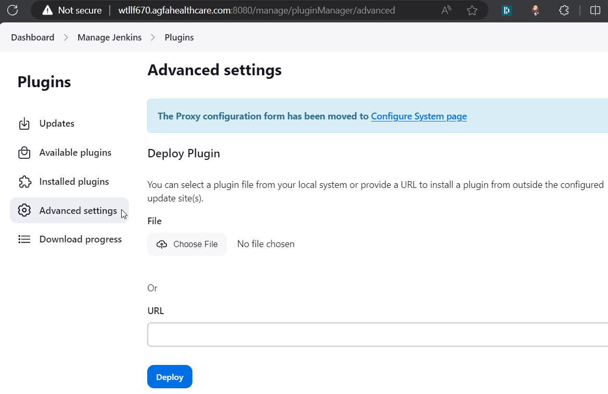
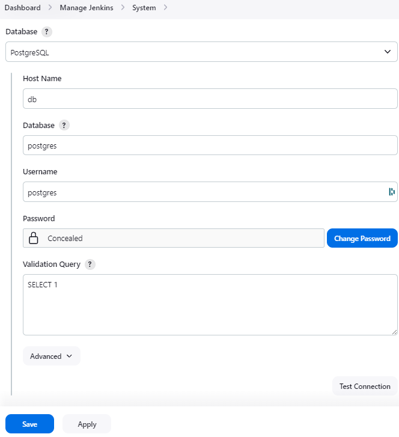

# JUnit SQL Storage Plugin

[](https://ci.jenkins.io/job/Plugins/job/junit-sql-storage-plugin/job/master/)
[](https://github.com/jenkinsci/junit-sql-storage-plugin/graphs/contributors)
[](https://plugins.jenkins.io/junit-sql-storage)
[](https://github.com/jenkinsci/junit-sql-storage-plugin/releases/latest)
[](https://plugins.jenkins.io/junit-sql-storage)

## Introduction

Implements the pluggable storage API for the [JUnit plugin](https://plugins.jenkins.io/junit/).

In common CI/CD use-cases a lot of the space is consumed by test reports. 
This data is stored within JENKINS_HOME, and the current storage format requires huge overheads when retrieving statistics and, especially trends. 
In order to display trends, each report has to be loaded and then processed in-memory.

The main purpose of externalising Test Results is to optimize Jenkins performance by querying the desired data from external storage.

This plugin adds a SQL extension, we currently support PostgreSQL and MySQL, others can be added, create an issue or send a pull request.

Tables will be automatically created.

## Getting started

To install the plugin login to Jenkins → Manage Jenkins → Manage Plugins → Available → Search for 'JUnit SQL Storage' → Install.

Use the following steps if you want to build and install the plugin from source.

### Building

To build the plugin use the `compile` goal
```
$ mvn clean compile
```
to run the tests use the `test` goal
```
$ mvn clean test
```

### Deploying Jenkins and the plugin

To try out your changes you can deploy Jenkins using the `deploy.sh` file provided in the repository.
```
$ ./deploy.sh
```
This will compile the junit-sql-storage plugin (.hpi file), build a docker image of Jenkins with the compiled 
junit-sql-storage plugin installed, then deploy the docker swarm of jaeger, postgresql, and Jenkins. 

### UI

You can also use the Jenkins UI to install the plugin and configure it.

### Installing Compiled Plugin

Once you've compiled the plugin (see above) you can install it from the Jenkins UI. Go to 'Manage Jenkins' → 'Plugins' 
→ 'Advanced' → 'Deploy' → 'Choose File' → 'Deploy'



Next, install your database vendor specific plugin, you can use the Jenkins plugin site to search for it:

https://plugins.jenkins.io/ui/search/?labels=database

e.g. you could install the [PostgreSQL Database](https://plugins.jenkins.io/database-postgresql/) plugin or the 
[MySQL Database](https://plugins.jenkins.io/database-mysql/) plugin.

Manage Jenkins → Configure System → Junit

In the dropdown select 'SQL Database'


Manage Jenkins → Configure System → Global Database

Select the database implementation you want to use and click 'Test Connection' to verify Jenkins can connect



> **Note:** use `db` as the 'Host Name' if running Jenkins from inside a docker container as part of the 
> docker-compose.yaml deployment

Click 'Save'

### Configuration as code

You can also configure the plugin using the [Configuration as Code](https://plugins.jenkins.io/configuration-as-code/) plugin.

```yaml
unclassified:
  globalDatabaseConfiguration:
    database:
      postgreSQL:
        database: "jenkins"
        hostname: "${DB_HOST_NAME}"
        password: "${DB_PASSWORD}"
        username: "${DB_USERNAME}"
        validationQuery: "SELECT 1"
  junitTestResultStorage:
    storage: "database"
```

Here's an example of how to use it

```
java -jar java-cli.jar -s http://<host.domain.name>:8080 -auth admin:<api_token> apply-configuration < junit-sql-storage-plugin-config.yml
```

### Accessing Jaeger

You can access the Jaeger UI by going to `http://localhost:16686`, here you can view the performance of the Jenkins 
server and your plugin changes.

### Accessing the database

You can also query the postgres database by connecting to the `db` container.

```
$ docker exec -it junit-sql-storage-plugin-db-1 psql -U postgres
psql (16.3 (Debian 16.3-1.pgdg120+1))
Type "help" for help.

postgres=# SELECT * FROM caseResults LIMIT 2;
    job     | build |                           suite                            |                  package                  |                         classname                          |         testname         | errordetails | skipped | duration | stdout | stderr | st
acktrace |         timestamp
------------+-------+------------------------------------------------------------+-------------------------------------------+------------------------------------------------------------+--------------------------+--------------+---------+----------+--------+--------+---
---------+----------------------------
 xxxx-xxxxx |     1 | xxx.xxxx.xxx.xxxx.xxxxxx.xxxxxxxxxxxxxxxxxxxxxxxx          | xxx.xxxx.xxx.xxxx.xxxxxx                  | xxx.xxxx.xxx.xxxx.xxxxxx.xxxxxxxxxxxxxxxxxxxxxxxx          | xxxxxxxxxxxxxxxxxxxxxxxx |              |         |    0.331 |        |        |
         | 2024-06-13 18:18:26.897532
 xxxx-xxxxx |     1 | xxx.xxxx.xxx.xxxxxxxxx.xxxxxxx.xxxxxxxxxx.xxxxxxxxxxxxxxxx | xxx.xxxx.xxx.xxxxxxxxx.xxxxxxx.xxxxxxxxxx | xxx.xxxx.xxx.xxxxxxxxx.xxxxxxx.xxxxxxxxxx.xxxxxxxxxxxxxxxx | xxxxxxxxxxxxxxxxxx       |              |         |    0.292 |        |        |
         | 2024-06-13 18:18:26.897532
(2 rows)
```

## Contributing

Refer to our [contribution guidelines](https://github.com/jenkinsci/.github/blob/master/CONTRIBUTING.md)

## LICENSE

Licensed under MIT, see [LICENSE](LICENSE.md)

