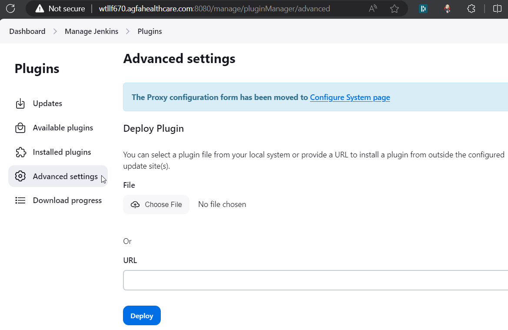
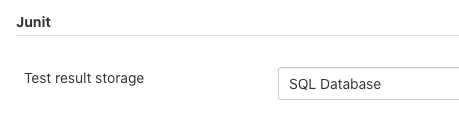
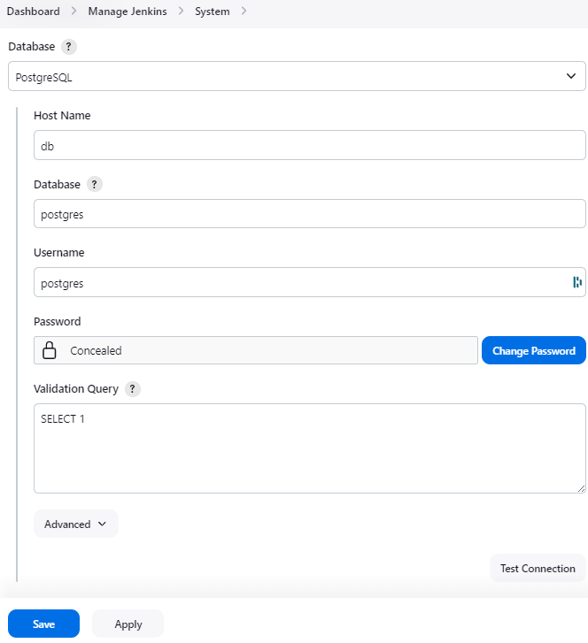

# JUnit SQL Storage Plugin

[](https://ci.jenkins.io/job/Plugins/job/junit-sql-storage-plugin/job/master/)
[](https://github.com/jenkinsci/junit-sql-storage-plugin/graphs/contributors)
[](https://plugins.jenkins.io/junit-sql-storage)
[](https://github.com/jenkinsci/junit-sql-storage-plugin/releases/latest)
[](https://plugins.jenkins.io/junit-sql-storage)

## Introduction

Implements the pluggable storage API for the [JUnit plugin](https://plugins.jenkins.io/junit/).

In common CI/CD use-cases a lot of the space is consumed by test reports. 
This data is stored within JENKINS_HOME, and the current storage format requires huge overheads when retrieving statistics and, especially trends. 
In order to display trends, each report has to be loaded and then processed in-memory.

The main purpose of externalising Test Results is to optimize Jenkins performance by querying the desired data from external storage.

This plugin adds a SQL extension, we currently support PostgreSQL and MySQL, others can be added, create an issue or send a pull request.

Tables will be automatically created.

## Getting started

To install the plugin login to Jenkins → Manage Jenkins → Manage Plugins → Available → Search for 'JUnit SQL Storage' → Install.

Use the following steps if you want to build and install the plugin from source.

### Building

To build the plugin use the `package` goal
```
$ mvn clean package -P quick-build
```
to run the tests use the `test` goal
```
$ mvn clean test
```

### Deploying Jenkins and the plugin

To try out your changes you can deploy Jenkins using the `deploy.sh` file provided in the repository.
```
$ ./deploy.sh
```
This will compile the junit-sql-storage plugin (.hpi file), build a docker image of Jenkins with the compiled 
junit-sql-storage plugin installed, then deploy the docker swarm of jaeger, postgresql, and Jenkins. 

### UI

You can also use the Jenkins UI to install the plugin and configure it.

### Installing Compiled Plugin

Once you've compiled the plugin (see above) you can install it from the Jenkins UI. Go to 'Manage Jenkins' → 'Plugins' 
→ 'Advanced' → 'Deploy' → 'Choose File' → 'Deploy'



Next, install your database vendor specific plugin, you can use the Jenkins plugin site to search for it:

https://plugins.jenkins.io/ui/search/?labels=database

e.g. you could install the [PostgreSQL Database](https://plugins.jenkins.io/database-postgresql/) plugin or the 
[MySQL Database](https://plugins.jenkins.io/database-mysql/) plugin.

Manage Jenkins → Configure System → Junit

In the dropdown select 'SQL Database'



Manage Jenkins → Configure System → Global Database

Select the database implementation you want to use and click 'Test Connection' to verify Jenkins can connect



> **Note:** use `db` as the 'Host Name' if running Jenkins from inside a docker container as part of the 
> docker-compose.yaml deployment

Click 'Save'

### Configuration as code

You can also configure the plugin using the [Configuration as Code](https://plugins.jenkins.io/configuration-as-code/) plugin.

```yaml
unclassified:
  globalDatabaseConfiguration:
    database:
      postgreSQL:
        database: "jenkins"
        hostname: "${DB_HOST_NAME}"
        password: "${DB_PASSWORD}"
        username: "${DB_USERNAME}"
        validationQuery: "SELECT 1"
  junitTestResultStorage:
    storage: "database"
```

Here's an example of how to use it

```
java -jar java-cli.jar -s http://<host.domain.name>:8080 -auth admin:<api_token> apply-configuration < junit-sql-storage-plugin-config.yml
```

### Accessing Jaeger

You can access the Jaeger UI by going to `http://localhost:16686`, here you can view the performance of the Jenkins 
server and your plugin changes.

### Accessing the database

You can also query the postgres database by connecting to the `db` container.

```
$ docker compose exec db psql -U postgres
psql (16.3 (Debian 16.3-1.pgdg120+1))
Type "help" for help.

postgres=# SELECT * FROM caseResults LIMIT 2;
    job     | build |                           suite                            |                  package                  |                         classname                          |         testname         | errordetails | skipped | duration | stdout | stderr | st
acktrace |         timestamp
------------+-------+------------------------------------------------------------+-------------------------------------------+------------------------------------------------------------+--------------------------+--------------+---------+----------+--------+--------+---
---------+----------------------------
 xxxx-xxxxx |     1 | xxx.xxxx.xxx.xxxx.xxxxxx.xxxxxxxxxxxxxxxxxxxxxxxx          | xxx.xxxx.xxx.xxxx.xxxxxx                  | xxx.xxxx.xxx.xxxx.xxxxxx.xxxxxxxxxxxxxxxxxxxxxxxx          | xxxxxxxxxxxxxxxxxxxxxxxx |              |         |    0.331 |        |        |
         | 2024-06-13 18:18:26.897532
 xxxx-xxxxx |     1 | xxx.xxxx.xxx.xxxxxxxxx.xxxxxxx.xxxxxxxxxx.xxxxxxxxxxxxxxxx | xxx.xxxx.xxx.xxxxxxxxx.xxxxxxx.xxxxxxxxxx | xxx.xxxx.xxx.xxxxxxxxx.xxxxxxx.xxxxxxxxxx.xxxxxxxxxxxxxxxx | xxxxxxxxxxxxxxxxxx       |              |         |    0.292 |        |        |
         | 2024-06-13 18:18:26.897532
(2 rows)
```

## Reproducing issues

### Issue #532: running-build test report reloads all test cases from the database on every call

[examples/issue-532/Jenkinsfile](examples/issue-532/Jenkinsfile) is a self-contained Pipeline that
reproduces [#532](https://github.com/jenkinsci/junit-sql-storage-plugin/issues/532): while a build is
still running, viewing its build page or "Test Result" page repeatedly reloads every test case from the
database because the result caches are invalidated on every access while `run.isBuilding()` is `true`.

Prerequisites:

- Jenkins configured with the JUnit SQL Storage plugin against a SQL database (MySQL or PostgreSQL).
- An agent with Python 3 and network connectivity to the configured database, matching the `AGENT_LABEL`
  parameter (defaults to `agent`).

Usage:

1. Create a Pipeline job and paste in the Jenkinsfile (or point the job at this file via "Pipeline script
   from SCM").
2. Run with the default `smoke` profile first (1,320 test cases across 38 packages, published by 4
   parallel `junit` steps) to validate the setup.
3. Switch the `PROFILE` parameter to `issue` to reproduce the exact dataset size from the report: 132,211
   test cases across 3,808 packages, published by 16 parallel `junit` steps.
4. Once publishing finishes, the build pauses at an `input` step (without holding an agent executor) for
   up to 30 minutes. While paused, repeatedly open the build page and its `testReport/` page, and watch
   the controller log for repeated `Loaded N package results from case results` / `Loaded N test cases
   from database` messages attributable to a single page view.
5. Click "Finish build" (or let the pause time out) to let the build complete, then reload the same pages
   to compare behavior once the cache is no longer invalidated on every access.

> [!WARNING]
> Only run the `issue` profile against a disposable Jenkins instance/job: it is designed to stress the
> controller and database in the same way as the original report.

As of the fix for #532, each build's test cases, package results, and pass/fail/skip/duration summary are
cached per-build (keyed by job name and build number) and loaded from the database at most once; the cache
is invalidated as soon as a `junit` step publishes new results for that build (not on every read), with a
one-minute time-based expiry as a safety net. The summary counts/duration are computed with a single SQL
aggregate query rather than by iterating the full case list, so viewing a running build's "Test Result"
page repeatedly no longer triggers repeated full reloads of every test case.

Because several builds' full case lists (including stdout/stderr/stack traces) can now be resident in
memory at once, the cache is also bounded by total cached test-case count (summed across all cached
builds), not just entry count, so that a handful of very large builds viewed around the same time cannot
exceed a bounded heap budget. The default budget is 150,000 cases; override it with the
`io.jenkins.plugins.junit.storage.database.DatabaseTestResultStorage.maxCachedCaseResults` system property
if your deployment's heap size and typical stdout/stderr payload sizes call for a different value.

## Contributing

Refer to our [contribution guidelines](https://github.com/jenkinsci/.github/blob/master/CONTRIBUTING.md)

## LICENSE

Licensed under MIT, see [LICENSE](LICENSE.md)

